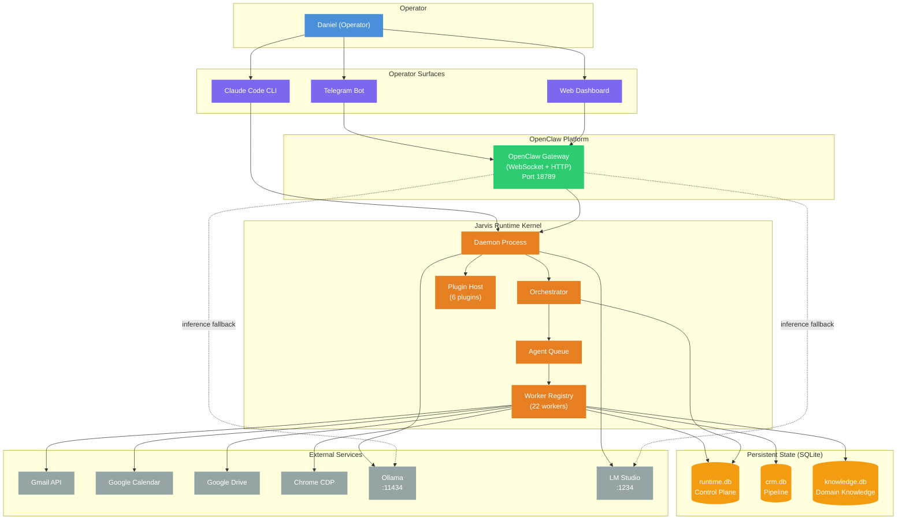
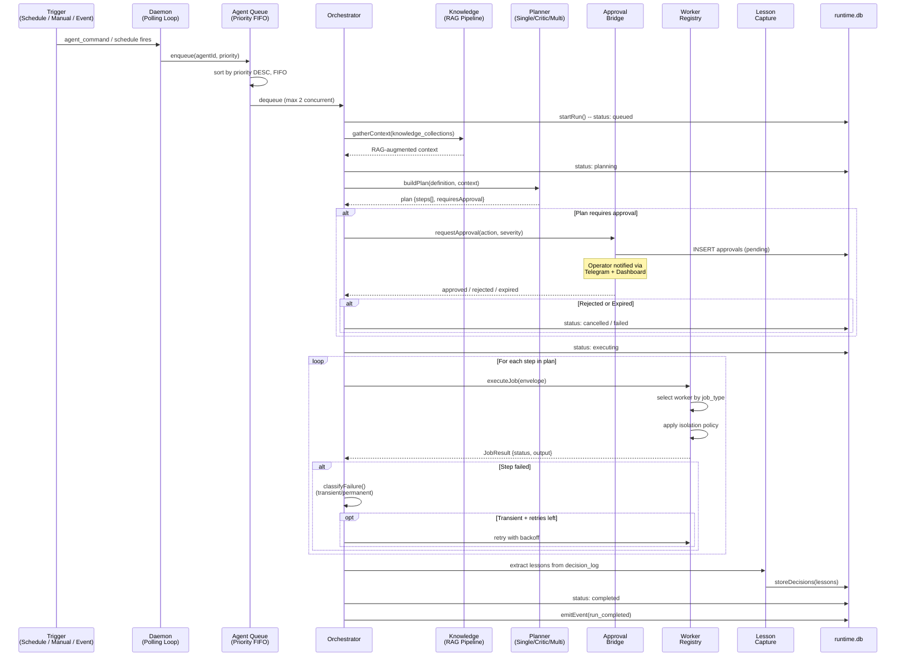
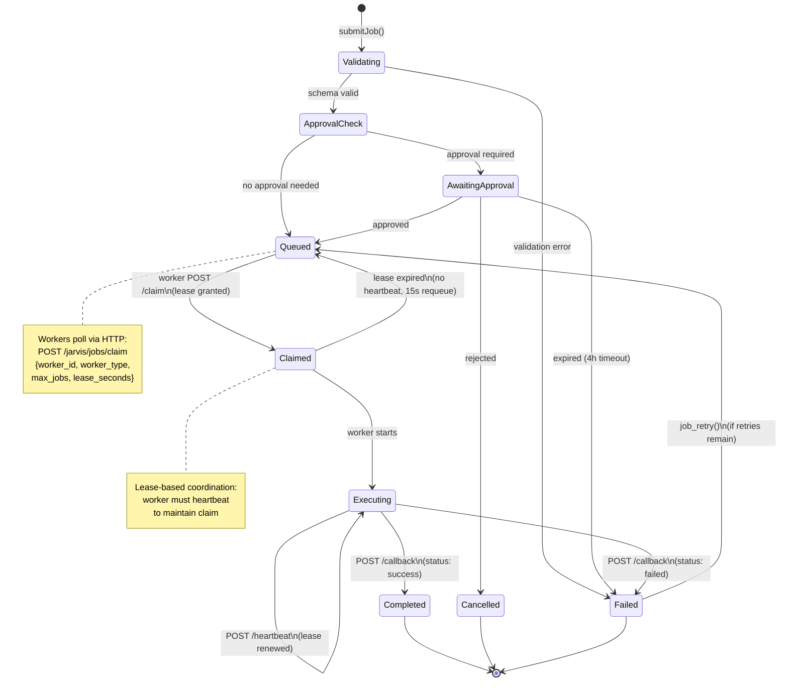
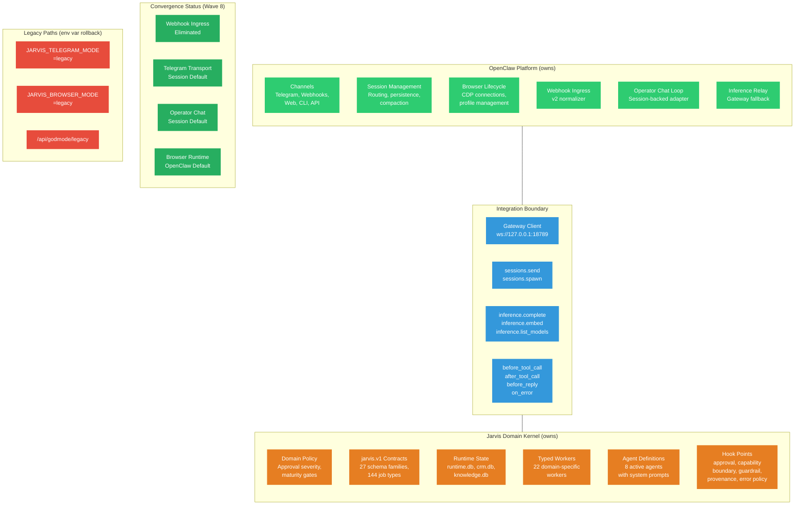

# Jarvis Architecture Diagrams

Seven views of the Jarvis autonomous agent system, from high-level context down to data models.

> Render with any Mermaid-compatible viewer (VS Code, GitHub, Mermaid Live Editor).

---

## 1. System Context

Who interacts with Jarvis and what external systems does it touch.

---

## 2. Five-Plane Architecture

The system is organized into five loosely-coupled planes.

```mermaid
graph LR
    subgraph OP["OPERATOR PLANE"]
        direction TB
        DASH["Dashboard\n(React + Express)"]
        TGBOT["Telegram Bot"]
        CLITOOL["CLI"]
        HEALTH["Health / Backup\n/ Restore"]
    end

    subgraph CP["CONTROL PLANE"]
        direction TB
        CMDS["Command Queue\n(agent_commands)"]
        RUNS["Run Lifecycle\n(runs, run_events)"]
        APPROV["Approvals\n(pending/approved/\nrejected/expired)"]
        HB["Daemon Heartbeats\n(10s interval)"]
        AUDIT["Audit Log\n(immutable)"]
        NOTIF["Notifications\n(outbound queue)"]
        SCHED["Schedules\n(durable cron)"]
    end

    subgraph EP["EXECUTION PLANE"]
        direction TB
        DAEMON2["Daemon\n(polling loop)"]
        ORCH2["Orchestrator\n(plan + execute)"]
        AQ["Agent Queue\n(priority, max 2)"]
        WR["Worker Registry"]
        subgraph WISO["Worker Isolation"]
            LOW["Low Risk\n(in-process)\ninference, crm,\nsystem, office, time"]
            MED["Medium Risk\n(+ timeout)\nemail, calendar,\ndrive, web, document"]
            HIGH["High Risk\n(child process)\nbrowser, interpreter,\nsocial, device, files"]
        end
    end

    subgraph IP["INFERENCE PLANE"]
        direction TB
        ROUTER["Model Router\n(TaskProfile -> Policy)"]
        MREG["Model Registry\n(discovered models)"]
        BENCH["Benchmark Cache"]
        OLL["Ollama"]
        LMS["LM Studio"]
        OCF["OpenClaw\n(fallback)"]
    end

    subgraph KP["KNOWLEDGE PLANE"]
        direction TB
        CRM["CRM\n(contacts, pipeline,\nnotes, campaigns)"]
        KNOW["Knowledge Store\n(documents, playbooks,\nentities, decisions)"]
        EG["Entity Graph\n(relations,\nprovenance)"]
        RAG["RAG Index\n(embedding_chunks)"]
        LESSONS["Lesson Capture"]
    end

    OP -->|read-only ingress| CP
    CP -->|commands, schedules| EP
    EP -->|job envelopes| IP
    EP -->|read/write| KP
    EP -->|state transitions| CP
    IP -->|inference results| EP

    classDef opStyle fill:#4A90D9,color:#fff,stroke:#3478C0
    classDef cpStyle fill:#9B59B6,color:#fff,stroke:#8241A0
    classDef epStyle fill:#E67E22,color:#fff,stroke:#D06A14
    classDef ipStyle fill:#2ECC71,color:#fff,stroke:#24B963
    classDef kpStyle fill:#F1C40F,color:#333,stroke:#D4AC0D

    class DASH,TGBOT,CLITOOL,HEALTH opStyle
    class CMDS,RUNS,APPROV,HB,AUDIT,NOTIF,SCHED cpStyle
    class DAEMON2,ORCH2,AQ,WR,LOW,MED,HIGH epStyle
    class ROUTER,MREG,BENCH,OLL,LMS,OCF ipStyle
    class CRM,KNOW,EG,RAG,LESSONS kpStyle
```

---

## 3. Package Dependency Graph

44 packages arranged by layer. Arrows point from dependent to dependency.

```mermaid
graph BT
    subgraph Foundation["Foundation Layer (0 deps)"]
        SHARED["@jarvis/shared"]
        OBS["@jarvis/observability"]
    end

    subgraph Framework["Framework Layer"]
        AF["@jarvis/agent-framework"]
        SUP["@jarvis/supervisor"]
    end

    subgraph Core["Core Services"]
        CORE["@jarvis/core"]
        JOBS["@jarvis/jobs"]
        DISP["@jarvis/dispatch"]
        SCHED2["@jarvis/scheduler"]
        INF["@jarvis/inference"]
        SEC["@jarvis/security"]
        SYS["@jarvis/system"]
        VOICE["@jarvis/voice"]
        DEV["@jarvis/device"]
        INTERP["@jarvis/interpreter"]
        OFF["@jarvis/office"]
        FILES["@jarvis/files"]
        BROWSER["@jarvis/browser"]
    end

    subgraph Workers["Workers (17)"]
        subgraph WLow["Low Risk (in-process)"]
            IW["inference-worker"]
            CW["crm-worker"]
            SW["system-worker"]
            OW["office-worker"]
            TW["time-worker"]
        end
        subgraph WMed["Medium Risk (+ timeout)"]
            EW["email-worker"]
            CALW["calendar-worker"]
            DW["drive-worker"]
            WW["web-worker"]
            DOCW["document-worker"]
        end
        subgraph WHigh["High Risk (child process)"]
            BW["browser-worker"]
            INTW["interpreter-worker"]
            SOCW["social-worker"]
            DEVW["device-worker\n(desktop-host)"]
            SECW["security-worker"]
        end
        VW["voice-worker"]
    end

    subgraph Plugins["Plugins (6)"]
        AP["agent-plugin"]
        EP2["email-plugin"]
        CALP["calendar-plugin"]
        CRMP["crm-plugin"]
        WP["web-plugin"]
        DP["document-plugin"]
    end

    subgraph Composite["Composite Packages"]
        AGENTS["@jarvis/agents"]
        AW["@jarvis/agent-worker"]
    end

    subgraph Hub["Orchestration Hub"]
        RT["@jarvis/runtime\n(22 internal deps)"]
    end

    subgraph Apps["Applications"]
        DASHBOARD["jarvis-dashboard"]
        TELEGRAM["jarvis-telegram"]
    end

    %% Foundation deps
    AF & SUP --> SHARED
    CORE & JOBS & DISP & SCHED2 & INF & SEC --> SHARED
    SYS & VOICE & DEV & INTERP & OFF & FILES & BROWSER --> SHARED

    %% Workers to shared
    IW & CW & SW & OW & TW --> SHARED
    EW & CALW & DW & WW & DOCW --> SHARED
    BW & INTW & SOCW & DEVW & SECW --> SHARED
    VW --> SHARED

    %% Supervisor pattern
    IW --> INF
    IW & INTW & SECW & SW & VW --> SUP

    %% Composite
    AGENTS --> AF
    AW --> AF
    SOCW --> BW

    %% Runtime hub
    RT --> AF & AGENTS & CORE & JOBS & DISP & SCHED2
    RT --> INF & SEC & OBS
    RT --> IW & CW & SW & OW & TW
    RT --> EW & CALW & DW & WW & DOCW
    RT --> BW & INTW & SOCW & DEVW & SECW & VW
    RT --> AW

    %% Apps
    DASHBOARD --> RT & AGENTS & OBS & SHARED
    TELEGRAM --> RT & SHARED

    classDef foundation fill:#2ECC71,color:#fff,stroke:none
    classDef framework fill:#3498DB,color:#fff,stroke:none
    classDef coreStyle fill:#9B59B6,color:#fff,stroke:none
    classDef workerLow fill:#27AE60,color:#fff,stroke:none
    classDef workerMed fill:#F39C12,color:#fff,stroke:none
    classDef workerHigh fill:#E74C3C,color:#fff,stroke:none
    classDef plugin fill:#1ABC9C,color:#fff,stroke:none
    classDef composite fill:#8E44AD,color:#fff,stroke:none
    classDef hub fill:#E67E22,color:#fff,stroke:none
    classDef app fill:#2C3E50,color:#fff,stroke:none

    class SHARED,OBS foundation
    class AF,SUP framework
    class CORE,JOBS,DISP,SCHED2,INF,SEC,SYS,VOICE,DEV,INTERP,OFF,FILES,BROWSER coreStyle
    class IW,CW,SW,OW,TW workerLow
    class EW,CALW,DW,WW,DOCW workerMed
    class BW,INTW,SOCW,DEVW,SECW,VW workerHigh
    class AP,EP2,CALP,CRMP,WP,DP plugin
    class AGENTS,AW composite
    class RT hub
    class DASHBOARD,TELEGRAM app
```

---

## 4. Agent Execution Flow

How an agent run progresses from trigger to completion.

---

## 5. Job Queue Lifecycle

State transitions for a single job from submission through completion.

---

## 6. Data Architecture

Three SQLite databases with WAL mode for concurrent access.

```mermaid
erDiagram
    %% ── runtime.db ──────────────────────────────────
    runs {
        text run_id PK
        text agent_id
        text status "queued|planning|executing|completed|failed|cancelled"
        text goal
        int current_step
        int total_steps
        text started_at
        text completed_at
    }
    run_events {
        text event_id PK
        text run_id FK
        text event_type
        text timestamp
        text payload_json
    }
    approvals {
        text approval_id PK
        text run_id FK
        text agent_id
        text action
        text severity "info|warning|critical"
        text status "pending|approved|rejected|expired"
        text requested_at
        text resolved_at
        text resolved_by
    }
    agent_commands {
        text command_id PK
        text agent_id
        text trigger_type
        text status
        text created_at
        text claimed_at
    }
    jobs {
        text job_id PK
        text job_type
        text status
        text worker_id
        text claim_id
        text lease_expires_at
        text payload_json
        text result_json
    }
    daemon_heartbeats {
        text daemon_id PK
        text status
        text last_beat
        int pid
    }
    schedules {
        text schedule_id PK
        text agent_id
        text cron_expression
        text next_run_at
        int enabled
    }
    agent_memory {
        text memory_id PK
        text agent_id
        text scope "short_term|long_term"
        text key
        text value_json
    }
    notifications {
        text notification_id PK
        text channel
        text status "pending|delivered|failed"
        text payload_json
    }
    audit_log {
        text entry_id PK
        text action
        text actor
        text timestamp
        text detail_json
    }
    model_registry {
        text model_id PK
        text runtime "ollama|lmstudio|openclaw"
        text size_class "small|medium|large"
        text capabilities
    }
    settings {
        text key PK
        text value
    }

    runs ||--o{ run_events : "emits"
    runs ||--o{ approvals : "requests"
    runs }o--|| agent_commands : "triggered by"
    runs ||--o{ jobs : "spawns"
    runs }o--|| schedules : "scheduled by"
    runs ||--o{ agent_memory : "produces"

    %% ── crm.db ──────────────────────────────────────
    contacts {
        text contact_id PK
        text name
        text company
        text role
        text email
        text linkedin
        text stage "prospect|qualified|contacted|meeting|proposal|negotiation|won|lost|parked"
        text tags
    }
    notes {
        text note_id PK
        text contact_id FK
        text type
        text content
        text created_at
    }
    stage_history {
        text history_id PK
        text contact_id FK
        text from_stage
        text to_stage
        text changed_at
        text changed_by
    }
    campaigns {
        text campaign_id PK
        text name
        text status
        text subject_template
    }
    campaign_recipients {
        text id PK
        text campaign_id FK
        text contact_id FK
        int current_step
        text status
    }

    contacts ||--o{ notes : "has"
    contacts ||--o{ stage_history : "transitions"
    campaigns ||--o{ campaign_recipients : "enrolls"
    contacts ||--o{ campaign_recipients : "enrolled in"

    %% ── knowledge.db ────────────────────────────────
    documents {
        text document_id PK
        text title
        text type "lesson|case-study|proposal|contract|playbook|iso26262"
        text content
        text tags
        text created_at
    }
    playbooks {
        text playbook_id PK
        text title
        text steps_json
        text domain
    }
    entities {
        text entity_id PK
        text canonical_key
        text type
        text name
        text attributes_json
    }
    relations {
        text relation_id PK
        text source_entity FK
        text target_entity FK
        text relation_type
        text provenance
    }
    decisions {
        text decision_id PK
        text run_id
        text agent_id
        text rationale
        text outcome
        text created_at
    }
    embedding_chunks {
        text chunk_id PK
        text document_id FK
        blob embedding
        text text_content
        int chunk_index
    }

    entities ||--o{ relations : "source"
    entities ||--o{ relations : "target"
    documents ||--o{ embedding_chunks : "chunked into"
```

---

## 7. Platform Boundary (OpenClaw vs Jarvis)

Ownership split and convergence status as of Wave 8.

---

## Quick Reference: Agent Roster

| Agent | Maturity | Schedule | Planner | Approval Gates |
|-------|----------|----------|---------|----------------|
| orchestrator | high_stakes | manual | multi | workflow.execute (warn), email.send (crit) |
| contract-reviewer | high_stakes | manual, email event | multi | document.generate_report (warn) |
| proposal-engine | high_stakes | manual, email event | multi | email.send (crit), document.generate_report (warn) |
| evidence-auditor | operational | Mon 09:00 | critic | document.generate_report (warn) |
| regulatory-watch | operational | Mon+Thu 07:00 | single | none |
| knowledge-curator | operational | Weekdays 06:00 | multi | knowledge.delete (crit), entity.merge (warn) |
| staffing-monitor | operational | Mon 09:00 | multi | email.send (crit) |
| self-reflection | trusted | Sun 06:00 | multi | none (read-only) |

## Quick Reference: Worker Isolation

| Risk | Isolation | Workers |
|------|-----------|---------|
| Low | In-process | inference, crm, system, office, time |
| Medium | In-process + timeout | email, calendar, drive, web, document |
| High | Child process + timeout + filesystem allowlist | browser, interpreter, social, device, security |
