# Jarvis -- Comprehensive Reference

> Generated from source: 2026-04-10 | Contract version: `jarvis.v1` | OpenClaw: `^2026.4.8`

### Reference Documents

This is the main reference. Detailed sub-references:

- **[Tool Reference](reference/tool-reference.md)** -- Full parameter documentation for all 100+ tools across 19 plugins
- **[Database Schema](reference/database-schema.md)** -- Column-level schema for all 3 SQLite databases (runtime.db, crm.db, knowledge.db)
- **[State Machines & Workflows](reference/state-machines.md)** -- All state transitions (run, approval, job, command, subgoal) and 9 workflow definitions

---

## 1. Overview

Jarvis is an autonomous agent system for **Thinking in Code**, an automotive safety consulting firm (ISO 26262, ASPICE, AUTOSAR, cybersecurity). It runs 8 production agents that handle regulatory watch, proposal generation, contract review, evidence auditing, staffing optimization, knowledge curation, self-reflection, and multi-agent orchestration. The system operates as a plugin pack on top of OpenClaw and persists all state in three SQLite databases under `~/.jarvis/`.

**Who it's for:** A single operator (Daniel) managing a 23-engineer consulting practice. All irreversible actions require human approval.

---

## 2. Architecture

### 2.1 High-Level Diagram

```mermaid
graph TB
    subgraph Channels
        TG[Telegram Bot]
        DASH[Dashboard :4242]
        CLI[Claude Code / CLI]
    end

    subgraph OpenClaw Gateway
        GW[Gateway :18789<br/>WebSocket + HTTP]
        SESS[Session Router]
        HOOKS[Hook Engine]
        GW --> SESS
        GW --> HOOKS
    end

    subgraph Jarvis Plugins x19
        CORE["@jarvis/core<br/>planning, approvals, model selection"]
        JOBS["@jarvis/jobs<br/>submit / claim / heartbeat / callback"]
        DISPATCH["@jarvis/dispatch<br/>cross-session messaging"]
        SCHED["@jarvis/scheduler<br/>cron + alerts + workflows"]
        AGENT_P["@jarvis/agent<br/>agent lifecycle"]
        EMAIL_P["@jarvis/email<br/>Gmail facade"]
        CAL_P["@jarvis/calendar<br/>Calendar facade"]
        CRM_P["@jarvis/crm<br/>pipeline management"]
        WEB_P["@jarvis/web<br/>web intelligence"]
        DOC_P["@jarvis/document<br/>document analysis"]
        BROWSER_P["@jarvis/browser<br/>browser facade"]
        OFFICE_P["@jarvis/office<br/>Excel/Word/PPT"]
        FILES_P["@jarvis/files<br/>safe file broker"]
        DEVICE_P["@jarvis/device<br/>desktop automation"]
        SYSTEM_P["@jarvis/system<br/>monitoring"]
        INF_P["@jarvis/inference<br/>local LLM routing"]
        INTERP_P["@jarvis/interpreter<br/>code execution"]
        SEC_P["@jarvis/security<br/>audit + lockdown"]
        VOICE_P["@jarvis/voice<br/>STT / TTS"]
    end

    subgraph Workers x17
        W_AGENT[agent-worker]
        W_EMAIL[email-worker]
        W_CAL[calendar-worker]
        W_CRM[crm-worker]
        W_WEB[web-worker]
        W_DOC[document-worker]
        W_BROWSER[browser-worker]
        W_OFFICE[office-worker]
        W_INF[inference-worker]
        W_INTERP[interpreter-worker]
        W_SEC[security-worker]
        W_SYS[system-worker]
        W_VOICE[voice-worker]
        W_SOCIAL[social-worker]
        W_TIME[time-worker]
        W_DRIVE[drive-worker]
        W_DESKTOP[desktop-host-worker]
    end

    subgraph Runtime Daemon
        QUEUE[Agent Queue<br/>max_concurrent: 1-16]
        PLANNER[Planner<br/>single / critic / multi]
        RAG[RAG Pipeline<br/>dense + BM25 hybrid]
        STATUS[Status Writer<br/>heartbeat 10s]
        HEALTH[Health / Readiness]
        ORCH[Orchestrator<br/>goal decomposition + DAG]
    end

    subgraph State Layer
        RDB[(runtime.db<br/>runs, approvals, jobs,<br/>models, schedules, memory)]
        CDB[(crm.db<br/>contacts, pipeline)]
        KDB[(knowledge.db<br/>docs, playbooks,<br/>entities, RAG index)]
    end

    subgraph External Services
        LMS[LM Studio :1234]
        OLLAMA[Ollama :11434]
        GMAIL[Gmail API]
        GCAL[Google Calendar API]
        GDRIVE[Google Drive API]
        TOGGL[Toggl API]
    end

    TG --> GW
    DASH --> GW
    CLI --> GW

    GW --> CORE & JOBS & DISPATCH & SCHED
    GW --> AGENT_P & EMAIL_P & CAL_P & CRM_P
    GW --> WEB_P & DOC_P & BROWSER_P & OFFICE_P
    GW --> FILES_P & DEVICE_P & SYSTEM_P & INF_P
    GW --> INTERP_P & SEC_P & VOICE_P

    JOBS -- "claim/heartbeat/callback" --> W_AGENT & W_EMAIL & W_CAL & W_CRM
    JOBS --> W_WEB & W_DOC & W_BROWSER & W_OFFICE
    JOBS --> W_INF & W_INTERP & W_SEC & W_SYS
    JOBS --> W_VOICE & W_SOCIAL & W_TIME & W_DRIVE & W_DESKTOP

    W_EMAIL --> GMAIL
    W_CAL --> GCAL
    W_DRIVE --> GDRIVE
    W_TIME --> TOGGL
    W_INF --> LMS & OLLAMA

    QUEUE --> PLANNER --> RAG
    QUEUE --> ORCH
    STATUS --> RDB
    HEALTH --> RDB & CDB & KDB

    CORE --> RDB
    JOBS --> RDB
    CRM_P --> CDB
    DOC_P --> KDB
    AGENT_P --> RDB
```



### 2.2 Data Flow

1. **Inbound:** Operator messages arrive via Telegram (session mode), Dashboard WebSocket, or Claude Code MCP.
2. **Routing:** OpenClaw gateway routes messages to sessions. Jarvis plugins register tools, commands, and hooks with the gateway.
3. **Job lifecycle:** Tools create `JobEnvelope` objects (contract version `jarvis.v1`) and submit them to the queue. Workers claim jobs via HTTP (`POST /jarvis/jobs/claim`), send heartbeats every 10s, and return results via callback (`POST /jarvis/jobs/callback`).
4. **Approval gates:** Mutating operations (email send, CRM stage move, file write) pass through hook-based approval. The hook engine checks severity (critical/warning/info) and blocks until operator approves or timeout expires.
5. **Agent execution:** The runtime daemon dequeues agent commands, selects a planner mode (single/critic/multi-viewpoint), generates a step plan via LLM inference, and executes steps sequentially. Each step may submit jobs, query knowledge (RAG), or request approval.
6. **Persistence:** All state lives in three SQLite databases. `runtime.db` holds the control plane. `crm.db` holds contacts and pipeline. `knowledge.db` holds documents, playbooks, entities, and the RAG index.

### 2.3 Execution Planes

| Plane | Components | Responsibility |
|-------|-----------|---------------|
| **Operator** | Telegram, Dashboard, CLI | Human interface, approval resolution |
| **Control** | Core plugin, scheduler, dispatch | Policy, planning, coordination |
| **Execution** | Agent queue, supervisor, 17 workers | Job claim, execution, callback |
| **Inference** | Inference plugin + worker, LM Studio, Ollama | LLM chat, embeddings, RAG |
| **Knowledge** | Agent framework, knowledge store, entity graph | Memory, lessons, document retrieval |

---

## 3. Prerequisites & Installation

### 3.1 Requirements

| Requirement | Version | Notes |
|-------------|---------|-------|
| Node.js | >= 22.5.0 | Required for OpenClaw SDK |
| npm | >= 10 | Workspace support |
| TypeScript | ^6.0.2 | Dev dependency, installed automatically |
| OpenClaw | ^2026.4.8 | Platform SDK, installed automatically |
| Windows 11 | 10.0+ | Desktop automation uses PowerShell |
| LM Studio | latest | Local inference backend (default `:1234`) |
| SQLite | bundled | Via better-sqlite3 |

**Optional:**

| Service | Purpose |
|---------|---------|
| Ollama (`:11434`) | Alternative inference backend |
| Gmail OAuth | Email agent capabilities |
| Google Calendar OAuth | Calendar agent capabilities |
| Google Drive OAuth | Drive worker |
| Telegram Bot Token | Telegram channel |
| Toggl API Token | Time tracking |
| Chrome (debugging port) | Browser automation |

### 3.2 Installation

```bash
git clone https://github.com/dturcu/jarvis.git
cd jarvis
npm install
```

### 3.3 First-Time Setup

**Interactive wizard:**

```bash
npm run setup
```

The wizard creates `~/.jarvis/`, initializes all three SQLite databases, and prompts for optional credentials (Telegram, Gmail OAuth, Chrome debugging URL, LM Studio URL).

**Non-interactive (CI / scripted):**

```bash
npx tsx scripts/init-jarvis.ts
```

Creates databases and runs migrations without prompting.

### 3.4 Verify Installation

```bash
npm run check    # validate contracts + run tests + build
```

This runs:
1. `npm run validate:contracts` -- validates 144 job types against JSON schemas and 145 example payloads
2. `npm test` -- 125 test files, 2860+ test cases
3. `npm run build` -- TypeScript compilation

---

## 4. Configuration

### 4.1 Config File

**Path:** `~/.jarvis/config.json`

| Key | Type | Default | Description |
|-----|------|---------|-------------|
| `lmstudio_url` | string | `"http://localhost:1234"` | LM Studio inference endpoint |
| `default_model` | string | `"auto"` | Model ID or `"auto"` for router selection |
| `adapter_mode` | `"mock"` \| `"real"` | `"mock"` | Worker adapter mode (mock for testing) |
| `poll_interval_ms` | number (1000+) | 2500 | Job queue polling interval |
| `trigger_poll_ms` | number (1000+) | 5000 | Schedule trigger polling interval |
| `max_concurrent` | number (1-16) | 2 | Maximum concurrent agent runs |
| `log_level` | `"debug"` \| `"info"` \| `"warn"` \| `"error"` | `"info"` | Log verbosity |
| `mode` | `"dev"` \| `"production"` | `"dev"` | Production enables auth enforcement |
| `appliance_mode` | boolean | false | Production appliance mode |
| `bind_host` | string | `"127.0.0.1"` | Dashboard bind address |
| `trust_proxy` | boolean | false | Trust X-Forwarded-For headers |
| `project_root` | string | (cwd) | Root for file operations |
| `webhook_secret` | string | (empty) | HMAC secret for webhook verification |
| `anthropic_api_key` | string | (empty) | Anthropic API key |
| `api_token` | string | (empty) | Dashboard auth token |
| `api_tokens` | string[] | [] | Additional API tokens |
| `gmail` | object | (empty) | `{ client_id, client_secret, refresh_token }` |
| `calendar` | object | (empty) | `{ client_id, client_secret, refresh_token }` |
| `drive` | object | (empty) | `{ client_id, client_secret, refresh_token }` |
| `chrome` | object | (empty) | `{ debugging_url }` |
| `telegram` | object | (empty) | `{ bot_token, chat_id }` |
| `toggl` | object | (empty) | `{ api_token, workspace_id }` |

### 4.2 Environment Variables

| Variable | Default | Description |
|----------|---------|-------------|
| `PORT` | `4242` | Dashboard HTTP port |
| `LMS_URL` | `http://localhost:1234` | LM Studio base URL (overrides config) |
| `LMS_MODEL` | `auto` | Default model (overrides config) |
| `JARVIS_PROJECT_ROOT` | (cwd) | File operations root |
| `JARVIS_CORS_ORIGIN` | `http://localhost:4242` | Dashboard CORS origin |
| `JARVIS_API_TOKEN` | (empty) | Dashboard auth token (empty = dev mode) |
| `JARVIS_BIND_HOST` | `127.0.0.1` | Dashboard bind host |
| `JARVIS_MODE` | `development` | `"production"` enforces auth |
| `JARVIS_WEBHOOK_SECRET` | (empty) | Webhook HMAC secret |
| `ANTHROPIC_API_KEY` | (empty) | Anthropic API key |
| `JARVIS_TELEGRAM_BOT_TOKEN` | (empty) | Telegram bot token |
| `JARVIS_TELEGRAM_CHAT_ID` | (empty) | Telegram destination chat |
| `JARVIS_TELEGRAM_MODE` | (default) | `"legacy"` for old polling bot |
| `JARVIS_TELEGRAM_SESSION_KEY` | `telegram:main` | OpenClaw session key for Telegram |
| `JARVIS_BROWSER_MODE` | (default) | `"legacy"` for old chrome-adapter |
| `JARVIS_FILES_ROOT` | (cwd) | Single root for file operations |
| `JARVIS_FILES_ALLOWED_ROOTS` | (empty) | Semicolon-separated allowed file dirs |
| `JARVIS_APPLIANCE_MODE` | (empty) | `"true"` enables appliance mode |
| `JARVIS_SMOKE_PROFILE` | (empty) | Smoke test profile (CI only) |
| `JARVIS_SMOKE_AGENT_ID` | (empty) | Smoke test agent (CI only) |
| `JARVIS_SMOKE_GATEWAY_PORT` | (empty) | Smoke test gateway port (CI only) |
| `JARVIS_SMOKE_LMSTUDIO_PORT` | (empty) | Smoke test LM Studio port (CI only) |
| `JARVIS_SMOKE_MODEL_KEY` | (empty) | Smoke test model key (CI only) |

### 4.3 Worker Credential Scoping

Workers receive only the credentials they need, scoped by worker type:

| Worker | Credential Scope |
|--------|-----------------|
| email | `gmail` |
| calendar | `calendar` |
| drive | `drive` |
| browser, social | `chrome` |
| time | `toggl` |
| All others | (none) |

---

## 5. Usage

### 5.1 CLI Commands

```bash
npm run jarvis <command>
```

| Command | Description |
|---------|-------------|
| `setup` | Interactive setup wizard |
| `doctor` | Verify installation health |
| `config` | Show/edit config |
| `init` | Initialize databases |
| `start` | Start daemon + dashboard |
| `stop` | Stop daemon |
| `status` | Show daemon status |
| `dashboard` | Start dashboard only |
| `logs` | Show recent logs |
| `health` | Run health check |
| `backup` | Create runtime backup |
| `restore` | Restore from backup |
| `migrate` | Run database migrations |
| `benchmark-models` | Benchmark local models |
| `demo` | Seed demo data |

### 5.2 NPM Scripts

```bash
npm start                    # Daemon + dashboard together
npm run daemon               # Daemon only
npm run dashboard            # Dashboard production mode (:4242)
npm run dashboard:dev        # Dashboard dev mode (hot reload)
npm run telegram-bot         # Telegram bot service

npm run check                # Full pipeline: contracts + tests + build
npm test                     # Tests only (125 files, 2860+ tests)
npm run test:stress          # Stress tests (separate config)
npm run build                # TypeScript compilation
npm run validate:contracts   # Schema + example validation (144 job types)
npm run check:architecture   # Boundary tests
npm run check:convergence    # Full convergence gate tests
npm run smoke:runtime        # OpenClaw + LM Studio smoke test

npm run ops:health           # Health check
npm run ops:backup           # Create backup
npm run ops:recover          # Restore from backup

npm run plugin:install       # Install plugin
npm run plugin:list          # List installed plugins
npm run plugin:remove        # Remove plugin
```

### 5.3 Agent Invocation

In Claude Code mode, agents are invoked as slash commands:

```
/orchestrator    -- Decompose goals, coordinate multi-agent workflows
/self-reflection -- Weekly system health analysis
/regulatory-watch -- Track ISO/ASPICE/EU regulatory changes
/knowledge-curator -- Ingest docs, maintain knowledge store
/proposal-engine -- Analyze RFQs, build quotes, generate proposals
/evidence-auditor -- Audit ISO 26262 / ASPICE evidence
/contract-reviewer -- Analyze NDA/MSA clauses
/staffing-monitor -- Track utilization, forecast gaps
```

In OpenClaw mode, agents run via schedules or commands:

```bash
# Manual trigger via dashboard API
curl -X POST http://localhost:4242/api/agents/orchestrator/run \
  -H "Authorization: Bearer $JARVIS_API_TOKEN" \
  -H "Content-Type: application/json" \
  -d '{"goal": "Generate Q2 staffing report"}'
```

### 5.4 Approval Flow

Mutating operations block until approved:

1. Agent requests approval (tool call triggers hook)
2. Notification sent to Telegram / Dashboard
3. Operator approves via `/approve <id> approved` (Telegram) or Dashboard button
4. Agent resumes execution

Timeouts: 5 minutes for built-in tools (exec, apply_patch, browser), 10 minutes for domain tools (email_send, crm_move_stage). Timeout behavior: deny.

---

## 6. Features

### 6.1 Agents (8 Active)

#### Orchestrator
- **ID:** `orchestrator`
- **Maturity:** high_stakes_manual_gate
- **Triggers:** manual, event (`workflow.start`)
- **Planner:** multi-viewpoint (3 perspectives: pragmatic, thorough, creative)
- **Max steps:** 20
- **Capabilities:** inference, crm, email, document, web, device
- **Behavior:** Decomposes goals into agent DAGs, presents execution plan for approval, dispatches agents in topological order, validates outputs, merges deliverables.
- **Approval gates:** `workflow.execute_multi` (warning), `email.send` (critical)
- **Output channels:** telegram:daniel

#### Self-Reflection
- **ID:** `self-reflection`
- **Maturity:** trusted_with_review
- **Triggers:** schedule (Sunday 06:00), manual
- **Planner:** critic (plan + critique + optional revision)
- **Max steps:** 6
- **Behavior:** Queries 7-day decision logs, approvals, and lessons. Produces `review_report` with health score (0-100) and 5+ ranked improvement proposals. Categories: prompt_change, schema_enhancement, knowledge_gap, retrieval_miss, approval_friction, workflow_optimization.
- **Constraint:** Read-only. Never self-modifies.

#### Regulatory-Watch
- **ID:** `regulatory-watch`
- **Maturity:** operational
- **Triggers:** schedule (Mon/Thu 07:00), manual
- **Planner:** single
- **Max steps:** 8
- **Behavior:** Searches news/RSS for ISO 26262, ISO 21434, ASPICE, UN R155/R156, ISO/PAS 8800, SOTIF, EU CRA, UNECE WP.29. Classifies findings (CRITICAL/HIGH/MEDIUM/LOW). Stores in `regulatory` knowledge collection. Only Telegram-notifies CRITICAL/HIGH.

#### Knowledge-Curator
- **ID:** `knowledge-curator`
- **Maturity:** operational
- **Triggers:** schedule (weekdays 06:00), manual, event (`document.received`)
- **Planner:** single
- **Max steps:** 10
- **Behavior:** Ingests documents and meetings. Parses, extracts entities, checks duplicates (>0.85 similarity threshold), stores with metadata, links entities to CRM. For meetings: extracts attendees, decisions, action items, risks. Runs collection health check (flags if no docs in 90+ days).
- **Approval gates:** `knowledge.delete` (critical), `entity.merge` (warning)
- **Knowledge collections:** proposals, case-studies, contracts, playbooks, iso26262, regulatory, meetings, lessons

#### Proposal-Engine
- **ID:** `proposal-engine`
- **Maturity:** high_stakes_manual_gate
- **Triggers:** manual, event (`email.received.rfq`)
- **Planner:** multi-viewpoint
- **Max steps:** 10
- **Behavior:** Ingests RFQ, extracts work packages, identifies risks, queries past proposals + case-studies + regulatory knowledge, queries CRM for client history, builds defensible quote. Generates DOCX proposal, drafts cover email, logs to CRM, builds invoice structure.
- **Quote rules:** Phase 1 always 2-4 weeks EUR 5-15k. No T&M for safety-critical. Rates: ASIL-D EUR 130-180/h, standard EUR 85-120/h.
- **Approval gates:** `email.send` (critical), `document.generate_report` (warning)
- **Artifacts:** proposal_document, cover_email, risk_summary, crm_note, invoice_structure

#### Evidence-Auditor
- **ID:** `evidence-auditor`
- **Maturity:** trusted_with_review
- **Triggers:** schedule (Monday 09:00), manual
- **Planner:** critic
- **Max steps:** 8
- **Behavior:** Scans project directory, parses work products, extracts ASIL level / revision / review status. Checks against ISO 26262 Part 6 checklist. Verifies traceability chains (HSR-FSR-TSR-SSR, SSR-Arch-Unit, SSR-Tests). Assesses DIA coverage. Generates gap matrix and gate-readiness summary (RED/YELLOW/GREEN).
- **Multimodal:** Accepts scanned PDFs, screenshots, images with OCR.
- **Approval gates:** `document.generate_report` (warning)

#### Contract-Reviewer
- **ID:** `contract-reviewer`
- **Maturity:** high_stakes_manual_gate
- **Triggers:** manual, event (`email.received.nda`)
- **Planner:** multi-viewpoint
- **Max steps:** 7
- **Behavior:** Ingests contract, extracts clauses by category (jurisdiction, confidentiality, IP, indemnity, liability, non-compete, termination, payment). Classifies each (OK/FLAG/RED FLAG). Queries past contracts with counterparty, EU legislation. Synthesizes recommendation: SIGN/NEGOTIATE/ESCALATE with risk score (0-100).
- **Baseline:** EU/Romanian law preferred, 3yr confidentiality, mutual indemnity, capped liability, 6mo non-compete, Net 30.
- **Multimodal:** Accepts scanned contracts with OCR.

#### Staffing-Monitor
- **ID:** `staffing-monitor`
- **Maturity:** operational
- **Triggers:** schedule (Monday 09:00), manual
- **Planner:** single
- **Max steps:** 8
- **Behavior:** Tracks 23-engineer team utilization (Romania + EU: 8 AUTOSAR, 6 Safety, 3 Cybersecurity, 4 Timing/MPU, 2 ASPICE). Target: 85% utilization (~160h/month). Warns at <70% or >95%. Forecasts gaps 4-6 weeks ahead. Matches skills to CRM pipeline.
- **Artifacts:** utilization_report, pipeline_gaps, staffing_recommendations, overall_health (GREEN/YELLOW/RED)
- **Approval gates:** `email.send` (critical)

### 6.2 Planning System

Three planner modes, selectable per agent via `planner_mode`:

| Mode | Process | Best for |
|------|---------|----------|
| `single` | LLM generates plan directly | Routine tasks, operational agents |
| `critic` | Plan -> Critique -> Optional revision | Quality-sensitive tasks |
| `multi` | N viewpoints (pragmatic/thorough/creative) -> Score -> Rank -> Optional critic on winner | High-stakes decisions |

**Plan scoring** (deterministic, no LLM):
- Capability coverage: 35% weight
- Step efficiency: 25% (sweet spot 40-80% of max_steps)
- Action diversity: 20%
- Reasoning quality: 20% (steps with reasoning > 20 chars)

**Disagreement detection:** Flags when step counts differ by >50% or >30% of actions are unique to a single plan.

### 6.3 Job Queue

**Lifecycle:** submit -> claim -> heartbeat -> callback

| Phase | Mechanism |
|-------|-----------|
| Submit | Plugin creates `JobEnvelope` via `submitJob()` |
| Claim | Worker polls `POST /jarvis/jobs/claim` with worker_id and routes |
| Heartbeat | Worker sends `POST /jarvis/jobs/heartbeat` every 10s |
| Callback | Worker returns result via `POST /jarvis/jobs/callback` |
| Requeue | Expired leases requeued after 15s |

**144 job types** across 27 schema families. Each envelope includes: contract_version, job_id (UUID), type, session_key, requested_by, priority, approval_state, timeout_seconds, attempt, input, artifacts_in, retry_policy, metadata.

### 6.4 Approval System

**Hook-based enforcement** (registered with OpenClaw `before_tool_call`):

| Hook | Priority | Targets | Severity | Timeout |
|------|----------|---------|----------|---------|
| Built-in approval | 0 | exec, apply_patch, browser | critical (exec), warning (others) | 300s |
| Domain approval | 10 | email_send, email_draft, crm_move_stage, crm_update_contact | critical (email), warning (CRM) | 600s |
| Capability boundary | -10 | All non-read-only tools | deny if context.readOnly | immediate |

**Additional hooks** (defined, awaiting OpenClaw hook point registration):
- `createProvenanceHook()` -- after_tool_call: records tool_name, duration_ms, timestamp
- `createReplyGuardrailHook()` -- before_reply: redacts API keys, credit cards, GitHub tokens, Telegram bot tokens
- `createErrorPolicyHook()` -- on_error: retryable errors (ECONNREFUSED, ETIMEDOUT, ENOTFOUND, WORKER_UNAVAILABLE) get 3 retries with exponential backoff (1s, 2s, 4s)

**Approval rules summary** (of 144 job types):
- 17 always require approval (email.send, device.click, device.type, system.kill_process, security.audit, social.*, etc.)
- 33 conditional (crm.move_stage, document.generate_report, device.open_app, files.write, etc.)
- 94 never require approval (all read-only: search, list, inspect, status, monitor)

### 6.5 Knowledge System

**9 collections:** lessons, playbooks, case-studies, contracts, proposals, iso26262, regulatory, meetings, garden

**Components:**
- **KnowledgeStore** -- Document CRUD, playbook management, search
- **EntityGraph** -- Entity types: contact, company, document, project, engagement. Relations: works_at, reports_to, related_to, authored, referenced_in. Traversal via `neighborhood()`.
- **LessonCapture** -- Post-run extraction. Each agent maps to a default collection (e.g., orchestrator->playbooks, evidence-auditor->iso26262).
- **RAG Pipeline** -- Hybrid search: dense (cosine similarity on embeddings) + sparse (BM25). Fusion via reciprocal rank fusion (k=60).

**Seed playbooks:** ASIL-D staffing, fixed-price conditions, objection handling, delivery gate, RFQ email template.

### 6.6 Memory System

**Per-agent memory:**
- **Short-term** -- Per-run context, cleared on run completion
- **Long-term** -- Persistent across runs, capped at 500 entries per agent
- **Decision log** -- Step-level action/reasoning/outcome audit trail

**Backing:** SQLite `agent_memory` table in `runtime.db` (via `SqliteMemoryStore`).

### 6.7 Inference Routing

**Supported backends:**
- LM Studio (`localhost:1234`, `/v1/models`)
- Ollama (`localhost:11434`, `/api/tags`)
- OpenClaw (via gateway adapter)

**Runtime detection:** Probes backends on startup (3s timeout). Uses the first available.

**Model registry:** SQLite-backed in `runtime.db`. Models tagged by `size_class` and `capabilities`.

**Task-profile-based routing:** Agent definitions declare a `TaskProfile` with objective, constraints, and preferences. The router selects the best available model.

### 6.8 Observability

Package: `@jarvis/observability`

**Metrics tracked:** job duration, queue depth, worker health, model latency, RAG retrieval time, approval funnel, provenance records, webhook ingress, session mode distribution, browser bridge calls, inference cost.

**Telemetry:** OpenTelemetry setup (`initTelemetry`, `shutdownTelemetry`), tracer/meter access.

**Provenance:** Content hashing, signature generation, artifact-level provenance records.

### 6.9 Dashboard

**Port:** 4242 (configurable via `PORT`)

**32 API modules** covering:

| Category | Endpoints |
|----------|-----------|
| Agents | List, run, configure agents |
| Approvals | List pending, approve/reject |
| Runs | History, details, cancel |
| Queue | Job queue status, job list |
| Knowledge | Search, ingest |
| Entities | Entity graph queries |
| CRM | Contacts, pipeline, notes |
| Models | Registry, benchmark, selection |
| Settings | Config read/write, mode |
| Daemon | Status, restart, stop |
| Backup | Create, restore, status |
| Health | System health report |
| Workflows | Definitions, execution |
| Plugins | List, surface inspection |
| Godmode | Operator chat (session-backed) |
| Chat | Chat interface with WebSocket streaming |

**Auth:** Bearer token validation. Rate limiting: 10 failed attempts -> 5-min block. Dev mode (empty token) allows unauthenticated access. `/api/health` is always unauthenticated.

### 6.10 Telegram Bot

**Session mode (default):** Messages delivered via OpenClaw session system. Bot is stateless receiver.

**Legacy mode:** Direct Telegram Bot API polling. Enable with `JARVIS_TELEGRAM_MODE=legacy`.

**Commands:** `/help`, `/status`, `/approve`, `/reject`, `/start`, `/stop`, `/logs`

**Behavior:**
- Rate limiting: 20 messages/minute per chat
- Retry: 3 attempts with exponential backoff (1s, 2s, 4s)
- Message truncation: 4096-char Telegram limit
- Approval polling: every 15s against `runtime.db`
- Agent notification relay: every 30s

### 6.11 Security

**Network:**
- Dashboard binds to `127.0.0.1` by default
- Auth required in production mode
- Webhook HMAC verification

**Tools:**
- Process scanning against whitelist
- Network connection auditing
- File integrity (SHA-256 baseline + check)
- Windows Firewall rule management
- Lockdown mode (standard/maximum)

**Hooks:**
- PII redaction in replies (API keys, credit cards, GitHub tokens)
- Capability boundary enforcement (read-only contexts blocked from mutations)
- Credential scoping per worker type

**Files:**
- Path allowlist enforcement via `JARVIS_FILES_ALLOWED_ROOTS`
- Write/patch/copy/move require approval

### 6.12 Office Automation

**Excel:** inspect, transform (column selection/rename/sheet selection), merge (union/append/by-sheet with dedup), extract tables (JSON/CSV/XLSX)

**Word:** inspect, template fill (strict variable checking)

**PowerPoint:** build (4 themes: corporate_clean, minimal_light, minimal_dark, executive_brief), inspect

**Output:** PNG/PDF/HTML/text preview

### 6.13 Desktop Automation

**Windows-specific** via PowerShell:
- Screenshot (desktop/active_window/window/display/region)
- Mouse click injection (left/right/middle, screen/window coordinates)
- Text input (insert/replace/paste mode)
- Keyboard shortcuts
- Clipboard read/write
- Window management (list, focus, layout)
- Virtual desktops
- Desktop notifications
- System metrics (CPU, memory, disk, network, battery, processes)
- Audio volume control
- Display settings
- Power actions
- Focus mode

---

## 7. Project Structure

```
jarvis/
|-- package.json                    # Workspace root, 44 packages, all npm scripts
|-- tsconfig.json                   # Composite TypeScript build
|-- tsconfig.base.json              # Shared compiler options + 44 path aliases
|-- vitest.config.ts                # Unit/integration test config
|-- vitest.stress.config.ts         # Stress test config (separate)
|-- .env                            # PORT, LMS_URL, LMS_MODEL
|-- .env.example                    # Full env var reference
|-- Dockerfile                      # Container build
|-- docker-compose.yml              # Multi-service compose
|-- CLAUDE.md                       # Project instructions for Claude Code
|-- README.md                       # Project README
|
|-- contracts/jarvis/v1/            # jarvis.v1 contract specification
|   |-- job-catalog.json            # 144 job type definitions
|   |-- plugin-surface.json         # 19 plugin registrations
|   |-- common.schema.json          # Shared types (uuid, channel, approval_state, ...)
|   |-- job-envelope.schema.json    # Job request format
|   |-- job-result.schema.json      # Job response format
|   |-- worker-callback.schema.json # Worker callback format
|   |-- tool-response.schema.json   # Tool response wrapper
|   |-- review-report.schema.json   # Audit report format
|   |-- *-job-types.schema.json     # 21 domain-specific job schemas
|   '-- examples/                   # 145 example job payloads
|
|-- packages/
|   |-- jarvis-shared/              # Base types, OpenClaw SDK, gateway utilities
|   |-- jarvis-core/                # Policy engine: hooks, approvals, model selection
|   |-- jarvis-agent-framework/     # Agent runtime, memory, knowledge, entity graph
|   |-- jarvis-agents/              # 8 active + 15 legacy agent definitions
|   |   |-- src/definitions/        # Active agent TypeScript definitions
|   |   |-- src/prompts/            # Active agent system prompts (Markdown)
|   |   |-- src/legacy/             # 15 archived agents
|   |   '-- src/data/               # Garden beds + planting calendar (JSON)
|   |-- jarvis-runtime/             # Daemon, planners, RAG, health, migrations
|   |-- jarvis-jobs/                # Job queue (submit/claim/heartbeat/callback)
|   |-- jarvis-dispatch/            # Cross-session messaging
|   |-- jarvis-scheduler/           # Cron, alerts, workflows, habits
|   |-- jarvis-supervisor/          # Worker process supervision
|   |-- jarvis-inference/           # LM Studio / Ollama / OpenClaw routing
|   |-- jarvis-interpreter/         # Code execution (Python/JS/shell)
|   |-- jarvis-security/            # Audit, scanning, lockdown
|   |-- jarvis-system/              # System monitoring
|   |-- jarvis-voice/               # STT / TTS / wake word
|   |-- jarvis-device/              # Desktop automation broker
|   |-- jarvis-observability/       # Metrics, tracing, provenance
|   |-- jarvis-browser/             # Browser facade + OpenClaw bridge
|   |-- jarvis-office/              # Office facade (Excel/Word/PPT)
|   |-- jarvis-files/               # Safe file broker with allowlists
|   |-- jarvis-agent-plugin/        # Agent lifecycle plugin
|   |-- jarvis-email-plugin/        # Gmail plugin
|   |-- jarvis-calendar-plugin/     # Calendar plugin
|   |-- jarvis-crm-plugin/          # CRM plugin
|   |-- jarvis-web-plugin/          # Web intelligence plugin
|   |-- jarvis-document-plugin/     # Document analysis plugin
|   |-- jarvis-*-worker/ (x17)     # Worker implementations (see sec. 6.3)
|   |-- jarvis-dashboard/           # React dashboard (Vite, port 4242)
|   '-- jarvis-telegram/            # Telegram bot service
|
|-- tests/                          # 125 test files
|   |-- *.test.ts                   # Unit + integration tests (71 files)
|   |-- smoke/                      # Smoke tests (18 files)
|   '-- stress/                     # Stress tests (40+ files)
|
|-- scripts/
|   |-- jarvis.mjs                  # CLI entrypoint
|   |-- start.mjs                   # Daemon + dashboard launcher
|   |-- setup-wizard.mjs            # Interactive setup
|   |-- setup-jarvis.ts             # TypeScript setup
|   |-- init-jarvis.ts              # Minimal DB init (CI)
|   |-- validate-contracts.mjs      # Contract validation
|   |-- seed-demo.ts                # Demo data seeder
|   |-- plugin-manager.ts           # Plugin install/list/remove
|   |-- runtime/                    # OpenClaw bootstrap + smoke harness
|   '-- ops/                        # Health check, backup, recovery
|
|-- docs/                           # 25 markdown files
|   |-- ARCHITECTURE.md             # System shape + execution planes
|   |-- CONVERGENCE-ROADMAP.md      # 12 epics, Waves 1-8 complete
|   |-- RELEASE-GATES.md            # 5 gates (A-E) with pass criteria
|   |-- ROADMAP.md                  # 3-year quarterly plan
|   |-- USAGE.md                    # User guide
|   |-- GLOSSARY.md                 # Canonical vocabulary
|   |-- THREAT-MODEL.md             # Trust boundaries, attack vectors
|   |-- OPERATOR-RUNBOOK.md         # Day-to-day operations
|   |-- specs/                      # Plugin API, device agent, model strategy, workflows
|   |-- runbooks/                   # Recovery, smoke test procedures
|   '-- quarters/                   # Quarterly release notes + migration plans
|
|-- .claude/
|   |-- skills/                     # 6 active Claude Code skill files
|   '-- skills/legacy/              # 8 archived skill files
|
'-- ~/.jarvis/                      # Runtime state (created by setup)
    |-- runtime.db                  # Control plane: runs, approvals, jobs, models, schedules
    |-- crm.db                      # CRM: contacts, notes, pipeline
    |-- knowledge.db                # Knowledge: docs, playbooks, entities, RAG index
    '-- config.json                 # Configuration
```

---

## 8. API / Integration Reference

### 8.1 Job Queue HTTP Routes

All routes served by the OpenClaw gateway (default `:18789`).

#### POST /jarvis/jobs/claim

Claim the next available job for a worker.

```json
// Request
{
  "worker_id": "email-worker-01",
  "routes": ["email"],
  "max_jobs": 1,
  "lease_duration_seconds": 60
}

// Response (200)
{
  "claim_id": "uuid",
  "job": { /* JobEnvelope */ }
}

// Response (204) -- no jobs available
```

#### POST /jarvis/jobs/heartbeat

Keep-alive for an active job claim.

```json
// Request
{
  "claim_id": "uuid",
  "worker_id": "email-worker-01",
  "progress": { "step": 2, "total": 5 }
}

// Response (200)
{ "ok": true }
```

#### POST /jarvis/jobs/callback

Return completed job result.

```json
// Request (WorkerCallback)
{
  "contract_version": "jarvis.v1",
  "job_id": "uuid",
  "job_type": "email.send",
  "attempt": 1,
  "status": "completed",
  "summary": "Email sent to client@example.com",
  "worker_id": "email-worker-01",
  "structured_output": { /* domain-specific */ },
  "metrics": {
    "queued_at": "2026-04-10T09:00:00Z",
    "started_at": "2026-04-10T09:00:01Z",
    "finished_at": "2026-04-10T09:00:03Z",
    "queue_seconds": 1,
    "run_seconds": 2,
    "attempt": 1,
    "worker_id": "email-worker-01"
  }
}
```

### 8.2 Dashboard API

**Base URL:** `http://localhost:4242/api`

**Auth:** `Authorization: Bearer <JARVIS_API_TOKEN>` (not required in dev mode)

| Method | Path | Description |
|--------|------|-------------|
| GET | `/agents` | List all agents with status |
| POST | `/agents/{id}/run` | Trigger agent run |
| PATCH | `/agents/{id}` | Update agent config |
| GET | `/approvals` | List pending approvals |
| POST | `/approvals/{id}/approve` | Approve action |
| POST | `/approvals/{id}/reject` | Reject action |
| GET | `/runs` | List run history |
| GET | `/runs/{id}` | Run details |
| POST | `/runs/{id}/cancel` | Cancel run |
| GET | `/queue/status` | Queue status summary |
| GET | `/queue/jobs` | List queued jobs |
| GET | `/knowledge/search?q=...` | Search knowledge base |
| POST | `/knowledge/ingest` | Ingest document |
| GET | `/entities` | List entities |
| GET | `/entities/{id}` | Entity details + neighborhood |
| GET | `/crm/contacts` | List CRM contacts |
| POST | `/crm/contacts` | Add contact |
| GET | `/models` | List registered models |
| GET | `/health` | Health report (unauthenticated) |
| GET | `/daemon/status` | Daemon status |
| POST | `/daemon/restart` | Restart daemon |
| GET | `/settings` | Get config |
| PATCH | `/settings` | Update config |
| POST | `/backup/create` | Create backup |
| POST | `/backup/restore` | Restore from backup |
| GET | `/tools` | List registered tools |
| GET | `/plugins` | List plugins |
| GET | `/workflows` | List workflow definitions |
| POST | `/chat` | Chat message |
| WS | `/chat/stream` | Chat WebSocket stream |
| POST | `/godmode/chat` | Operator chat (session-backed) |

### 8.3 Plugin Tool Surface

19 plugins expose 100+ tools. Key tools by domain:

| Plugin | Tools |
|--------|-------|
| `@jarvis/core` | jarvis_plan, jarvis_run_job, jarvis_get_job, jarvis_list_artifacts, jarvis_request_approval |
| `@jarvis/jobs` | job_submit, job_status, job_cancel, job_artifacts, job_retry |
| `@jarvis/dispatch` | dispatch_to_session, dispatch_followup, dispatch_broadcast, dispatch_notify_completion, dispatch_spawn_worker_agent |
| `@jarvis/email` | email_search, email_read, email_draft, email_send, email_archive, email_trash, email_label, email_forward |
| `@jarvis/calendar` | calendar_brief, calendar_list_events, calendar_create_event, calendar_find_free, calendar_update_event |
| `@jarvis/crm` | crm_digest, crm_list_pipeline, crm_search, crm_add_contact, crm_update_contact, crm_add_note, crm_move_stage |
| `@jarvis/browser` | browser_run_task, browser_extract, browser_capture, browser_download |
| `@jarvis/office` | office_inspect, office_transform, office_merge_excel, office_fill_docx, office_build_pptx, office_extract_tables, office_preview |
| `@jarvis/files` | files_inspect, files_read, files_search, files_write, files_patch, files_copy, files_move, files_preview |
| `@jarvis/device` | device_snapshot, device_screenshot, device_click, device_type, device_hotkey, device_clipboard_get, device_clipboard_set, device_notify, +15 more |
| `@jarvis/system` | system_monitor_cpu, system_monitor_memory, system_monitor_disk, system_monitor_network, system_monitor_battery, system_list_processes, system_kill_process, system_hardware_info |
| `@jarvis/inference` | inference_chat, inference_embed, inference_list_models, inference_rag_index, inference_rag_query, inference_batch_submit, inference_batch_status |
| `@jarvis/scheduler` | scheduler_create_schedule, scheduler_list_schedules, scheduler_delete_schedule, scheduler_create_alert, scheduler_create_workflow, scheduler_run_workflow, scheduler_habit_track, scheduler_habit_status |
| `@jarvis/interpreter` | interpreter_run_task, interpreter_run_code, interpreter_status |
| `@jarvis/security` | security_scan_processes, security_whitelist_update, security_network_audit, security_file_integrity_check, security_file_integrity_baseline, security_firewall_rule, security_lockdown |
| `@jarvis/voice` | voice_listen, voice_transcribe, voice_speak, voice_wake_word_start, voice_wake_word_stop |
| `@jarvis/web` | web_search_news, web_scrape_profile, web_monitor_page, web_enrich_contact, web_track_jobs, web_competitive_intel |
| `@jarvis/document` | document_extract, document_classify, document_summarize, document_find_entities, document_compare, document_index, document_batch_process |
| `@jarvis/agent` | agent_start, agent_step, agent_status, agent_pause, agent_resume, agent_configure |

### 8.4 Slash Commands (OpenClaw)

| Command | Plugin | Description |
|---------|--------|-------------|
| `/approve <id> <action>` | @jarvis/core | Resolve approval (approved/rejected/expired/cancelled) |
| `/dispatch` | @jarvis/dispatch | Send cross-session message |
| `/followup` | @jarvis/dispatch | Follow up on existing job |
| `/broadcast` | @jarvis/dispatch | Broadcast to multiple sessions |
| `/sendto` | @jarvis/dispatch | Send to specific session |
| `/excel` | @jarvis/office | Excel operations |
| `/word` | @jarvis/office | Word operations |
| `/ppt` | @jarvis/office | PowerPoint operations |
| `/office-status` | @jarvis/office | Office automation status |
| `/files` | @jarvis/files | File operations |
| `/browser` | @jarvis/browser | Browser automation |
| `/device` | @jarvis/device | Desktop automation |
| `/windows` | @jarvis/device | Window management |
| `/clipboard` | @jarvis/device | Clipboard operations |
| `/notify` | @jarvis/device | Desktop notifications |
| `/system` | @jarvis/system | System monitoring |
| `/processes` | @jarvis/system | Process management |
| `/hardware` | @jarvis/system | Hardware info |
| `/models` | @jarvis/inference | Model listing |
| `/benchmark` | @jarvis/inference | Model benchmarking |
| `/schedule` | @jarvis/scheduler | Schedule management |
| `/interpret` | @jarvis/interpreter | Run automation |
| `/run-code` | @jarvis/interpreter | Execute code |
| `/security` | @jarvis/security | Security audit |
| `/lockdown` | @jarvis/security | System lockdown |
| `/audit` | @jarvis/security | Run audit |
| `/voice` | @jarvis/voice | Voice I/O |
| `/listen` | @jarvis/voice | Capture audio |
| `/speak` | @jarvis/voice | Text to speech |
| `/email` | @jarvis/email | Email operations |
| `/inbox` | @jarvis/email | Inbox overview |
| `/calendar` | @jarvis/calendar | Calendar operations |
| `/crm` | @jarvis/crm | CRM operations |
| `/web` | @jarvis/web | Web intelligence |
| `/intel` | @jarvis/web | Competitive intelligence |
| `/document` | @jarvis/document | Document analysis |
| `/agent` | @jarvis/agent | Agent management |

### 8.5 Contract Schema (jarvis.v1)

**Job Envelope** (simplified):

```typescript
interface JobEnvelope {
  contract_version: "jarvis.v1";
  job_id: string;           // UUID v4
  type: string;             // e.g., "email.send"
  session_key: string;
  requested_by: {
    channel: Channel;       // telegram | web | cli | api | ...
    user_id?: string;
    username?: string;
  };
  priority: "low" | "normal" | "high" | "urgent";
  approval_state: "pending" | "approved" | "rejected" | "expired" | "cancelled" | "not_required";
  timeout_seconds: number;
  attempt: number;
  input: Record<string, unknown>;  // Domain-specific
  artifacts_in?: ArtifactRef[];
  retry_policy?: { mode: "never" | "manual" | "exponential"; max_attempts: number; backoff_seconds: number };
  metadata?: Record<string, unknown>;
}
```

**Job Result** (simplified):

```typescript
interface JobResult {
  status: "completed" | "failed" | "cancelled";
  summary: string;
  structured_output?: Record<string, unknown>;
  error?: { code: string; message: string; retryable: boolean; field?: string; details?: unknown };
  logs?: LogEntry[];
  metrics: Metrics;
}
```

### 8.6 External Integrations

| Service | Auth Method | Used By |
|---------|------------|---------|
| Gmail API | OAuth2 (client_id, client_secret, refresh_token) | email-worker |
| Google Calendar API | OAuth2 | calendar-worker |
| Google Drive API | OAuth2 | drive-worker |
| Toggl API | API token + workspace ID | time-worker |
| LM Studio | No auth (localhost) | inference-worker |
| Ollama | No auth (localhost) | inference-worker |
| Telegram Bot API | Bot token | jarvis-telegram |
| Chrome DevTools | Debugging URL (localhost) | browser-worker |

### 8.7 Webhook Ingress

> Webhook ingress (`webhooks.ts`) was eliminated in Wave 1 of convergence. Inbound events now route through the OpenClaw gateway session system.

---

## 9. Troubleshooting

### 9.1 Health Check

```bash
npm run ops:health
# or
curl http://localhost:4242/api/health
```

Returns `healthy`, `degraded`, or `unhealthy` based on:
- Database availability (runtime.db, crm.db, knowledge.db)
- Daemon heartbeat freshness (stale if >30s since last write)
- Pending approvals and commands
- Disk free space

### 9.2 Readiness Check

`getReadinessReport()` verifies:
- `~/.jarvis/` directory exists
- All three databases exist and are accessible
- Config is valid
- Daemon is running (heartbeat fresh)
- Migrations are current
- No stale job claims (>10 minutes)
- No overdue schedules

### 9.3 Common Issues

| Symptom | Cause | Fix |
|---------|-------|-----|
| `ECONNREFUSED :1234` | LM Studio not running | Start LM Studio, verify `LMS_URL` |
| `ECONNREFUSED :11434` | Ollama not running | Start Ollama or remove from config |
| `ECONNREFUSED :18789` | OpenClaw gateway not running | Start gateway via `npm run runtime:bootstrap` |
| Daemon shows `unhealthy` | Stale heartbeat (>30s) | Check if daemon process is alive: `npm run jarvis status` |
| Approval timeout | No operator response within timeout | Increase timeout in hook or respond faster |
| `PATH_NOT_ALLOWED` | File operation outside allowed roots | Set `JARVIS_FILES_ALLOWED_ROOTS` |
| `CAPABILITY_BOUNDARY` | Mutating tool called in read-only context | Check context.readOnly flag; use appropriate tool |
| Job stuck in `running` | Worker crashed without callback | Requeue via expired lease mechanism (15s) or manual `job_retry` |
| Auth failures on dashboard | Missing or wrong `JARVIS_API_TOKEN` | Set token in env or config; empty = dev mode |
| Rate limit on Telegram | >20 messages/minute per chat | Reduce message frequency |
| SQLite `SQLITE_BUSY` | Concurrent writes | WAL mode is enabled; ensure single daemon instance |
| Stale claims in readiness | Worker claimed but never completed | Claims auto-expire; check worker health |
| Safe mode active | `StatusWriter.setSafeMode(true)` was called | Investigate reason; restart daemon to exit |

### 9.4 Error Codes

Standardized across all workers:

| Code | Meaning |
|------|---------|
| `INVALID_INPUT` | Job input failed schema validation |
| `PATH_NOT_ALLOWED` | File path outside allowed roots |
| `FILE_NOT_FOUND` | Target file does not exist |
| `TIMEOUT` | Job exceeded timeout_seconds |
| `WORKER_UNAVAILABLE` | No worker registered for route |
| `APPROVAL_DENIED` | Operator rejected the action |
| `APPROVAL_TIMEOUT` | Approval window expired |
| `CAPABILITY_BOUNDARY` | Tool blocked by read-only context |
| `ECONNREFUSED` | Backend service unreachable |
| `ETIMEDOUT` | Network timeout |
| `ENOTFOUND` | DNS resolution failed |

### 9.5 Backup & Recovery

```bash
# Create backup (databases + config + manifests)
npm run ops:backup

# Restore (transactional, all-or-nothing)
npm run ops:recover
```

Backups are timestamp-named, validated on creation and before restore.

---

## 10. Development

### 10.1 Build & Test

```bash
npm install                  # Install all workspace dependencies
npm run build                # TypeScript compilation (tsc -b)
npm test                     # All tests (vitest, 125 files)
npm run test:stress          # Stress tests (separate vitest config)
npm run validate:contracts   # JSON schema validation
npm run check                # Full pipeline: contracts + tests + build
npm run check:architecture   # Boundary + hook + credential + convergence tests
```

### 10.2 Architecture Boundary Tests

`tests/architecture-boundary.test.ts` enforces forbidden import patterns:
- Plugins must not import from workers directly
- Workers must not import from plugins
- Shared layer must not import from runtime
- No circular dependencies between packages

Run: `npm run check:architecture`

### 10.3 Test Categories

| Category | Count | Config | What it validates |
|----------|-------|--------|-------------------|
| Unit + integration | 71 | `vitest.config.ts` | Individual functions, state machines, policies |
| Smoke | 18 | `vitest.config.ts` | End-to-end lifecycle, approval channels, restart recovery |
| Stress | 40+ | `vitest.stress.config.ts` | Concurrency, memory pressure, exhaustive input coverage |
| Architecture | 4 | `vitest.config.ts` | Import boundaries, hook catalog, credential scoping |

### 10.4 Adding a New Job Type

1. Add the type to the appropriate `*-job-types.schema.json` in `contracts/jarvis/v1/`
2. Add an entry to `job-catalog.json`
3. Add example payloads in `contracts/jarvis/v1/examples/`
4. Implement the handler in the appropriate worker's `execute.ts`
5. Register the tool in the plugin's `index.ts`
6. Update `JOB_TYPE_NAMES` in `packages/jarvis-shared/src/contracts.ts`
7. Run `npm run validate:contracts` to verify schema alignment
8. Run `npm run check` for full validation

### 10.5 Adding a New Agent

1. Create definition in `packages/jarvis-agents/src/definitions/<agent-id>.ts`
2. Create system prompt in `packages/jarvis-agents/src/prompts/<agent-id>.md`
3. Register in `ALL_AGENTS` array in `packages/jarvis-agents/src/registry.ts`
4. Create Claude Code skill file in `.claude/skills/<agent-id>.md`
5. Map to default knowledge collection in `AGENT_DEFAULT_COLLECTION` (`packages/jarvis-agent-framework/src/lesson-capture.ts`)

### 10.6 Branch & PR Conventions

- Branch from `master`
- Create PR before merging (never merge directly to master)
- PR title: short descriptive summary
- CI runs: `npm run check` (contracts + tests + build)

### 10.7 Docker

```bash
docker compose up          # Start all services
docker compose up dashboard # Dashboard only
```

Dockerfile and docker-compose.yml are present at the project root.

---

## 11. Changelog (Documentation Update)

**2026-04-10:** Generated comprehensive reference from source audit.

### Counts verified against codebase:

| Metric | Value |
|--------|-------|
| Packages | 44 |
| Job types | 144 |
| Schema families | 27 (21 domain + 6 shared) |
| Contract examples | 145 |
| Plugins | 19 |
| Workers | 17 |
| Active agents | 8 |
| Legacy agents | 15 |
| Test files | 125 |
| Test cases | 2860+ |
| Dashboard API modules | 32 |
| Slash commands | 35+ |
| Tools | 100+ |
| SQLite databases | 3 |

### Discrepancies found and corrected in other docs:

| File | Old | New | Field |
|------|-----|-----|-------|
| `CLAUDE.md` | 43 packages | 44 | Added @jarvis/observability |
| `CLAUDE.md` | 92 test files, 2384+ tests | 125 files, 2860+ tests | Test counts |
| `CLAUDE.md` | 23 schema families | 27 | Schema count |
| `CLAUDE.md` | 144 examples | 145 | Example count |
| `CLAUDE.md`, `README.md`, `GLOSSARY.md`, `THREAT-MODEL.md`, `WHAT-JARVIS-IS-NOT.md`, `RELEASE-GATES.md` | 143 job types | 144 | Job type count |

---

## Appendix A: Database Schema Summary

### runtime.db

| Table | Purpose |
|-------|---------|
| `agent_commands` | Durable command queue (webhook/manual/schedule triggers) |
| `approvals` | Approval state machine (pending -> approved/rejected/expired/cancelled) |
| `run_events` | Immutable run event audit trail |
| `daemon_heartbeats` | Daemon liveness (UPSERT every 10s) |
| `notifications` | Outbound notification queue |
| `schedules` | Durable cron schedules (survives restart) |
| `agent_memory` | Short-term and persistent agent memory |
| `audit_log` | Security-sensitive action trail |
| `settings` | Runtime-configurable settings |
| `plugin_installs` | Plugin lifecycle tracking |
| `model_registry` | Discovered local models with capabilities |
| `model_benchmarks` | Cached benchmark results |
| `channel_messages` | Message history (best-effort) |

### crm.db

| Table | Purpose |
|-------|---------|
| `contacts` | Contact records |
| `notes` | Contact notes |
| `stages` | Pipeline stage history |
| `deals` | Deal pipeline |

**Pipeline stages:** prospect -> qualified -> contacted -> meeting -> proposal -> negotiation -> won | lost | parked

### knowledge.db

| Table | Purpose |
|-------|---------|
| `documents` | Knowledge documents across 9 collections |
| `playbooks` | Reusable playbooks with use_count tracking |
| `entities` | Entity records (contact, company, document, project, engagement) |
| `relations` | Entity relationships (works_at, reports_to, authored, ...) |
| `decisions` | Agent decision logs |
| `rag_chunks` | RAG vector index chunks |

---

## Appendix B: Agent Schedule Summary

| Agent | Schedule | Cron |
|-------|----------|------|
| self-reflection | Sunday 06:00 | `0 6 * * 0` |
| regulatory-watch | Monday + Thursday 07:00 | `0 7 * * 1,4` |
| knowledge-curator | Weekdays 06:00 | `0 6 * * 1-5` |
| evidence-auditor | Monday 09:00 | `0 9 * * 1` |
| staffing-monitor | Monday 09:00 | `0 9 * * 1` |
| orchestrator | Manual / event only | -- |
| proposal-engine | Manual / event only | -- |
| contract-reviewer | Manual / event only | -- |

---

## Appendix C: Convergence Status

All four primary-path duplication targets from Year 1 are addressed (Waves 1-8 complete):

| Target | Status | Legacy Fallback |
|--------|--------|-----------------|
| Webhook ingress | **Eliminated** | `webhooks.ts` deleted |
| Telegram transport | **Session default** | `JARVIS_TELEGRAM_MODE=legacy` |
| Operator chat (godmode) | **Session default** | `/api/godmode/legacy` |
| Browser runtime | **OpenClaw default** | `JARVIS_BROWSER_MODE=legacy` |

See `docs/CONVERGENCE-ROADMAP.md` for the full 12-epic map and `docs/RELEASE-GATES.md` for gate criteria.

---

## Appendix D: Known Gaps

> These are documented limitations, not bugs. See `docs/KNOWN-TRUST-GAPS.md` and `docs/ARCHITECTURE-STATUS.md` for details.

| Gap | Impact | Tracking |
|-----|--------|----------|
| Encrypted credentials not implemented | Plaintext in `~/.jarvis/config.json` | Blocks Gate C |
| Hook registration incomplete | `after_tool_call`, `before_reply`, `on_error` hooks defined but not registered | Awaiting OpenClaw support (Epic 8) |
| Agent roster empty in ALL_AGENTS | Agent definitions exist but roster wiring TBD | Platform Adoption Roadmap |
| `check:convergence` not in CI | Convergence tests not automated | Platform Adoption Roadmap |
| Entity graph canonical_key format unspecified | No validation on key format | -- |
| Memory long-term cap hardcoded | 500 entries per agent, no config option | -- |
| RAG chunk size hardcoded | No configurable chunk size parameter | -- |
| Safe mode exit mechanism undocumented | `setSafeMode(true)` exists but no documented exit path | -- |
