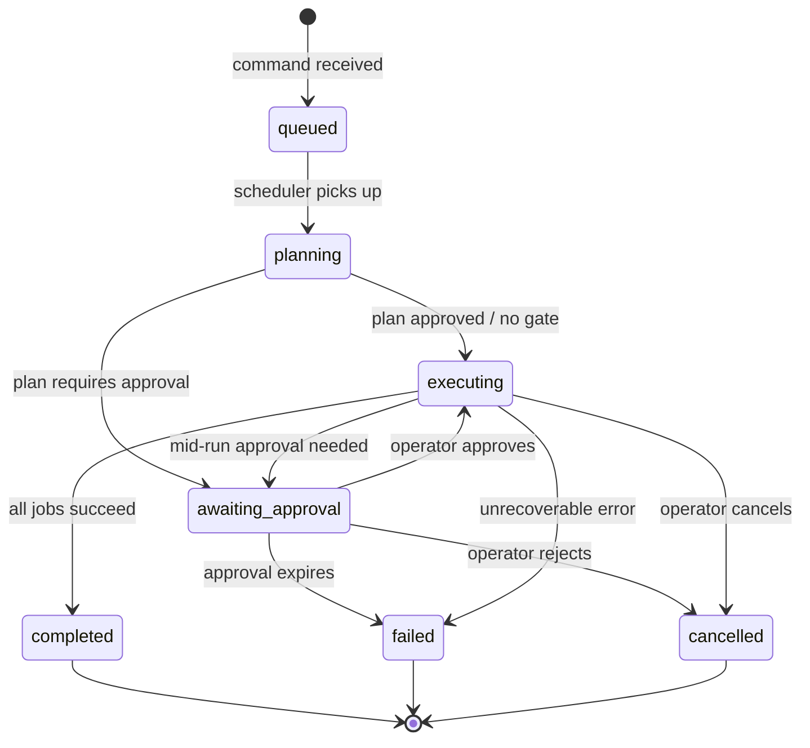
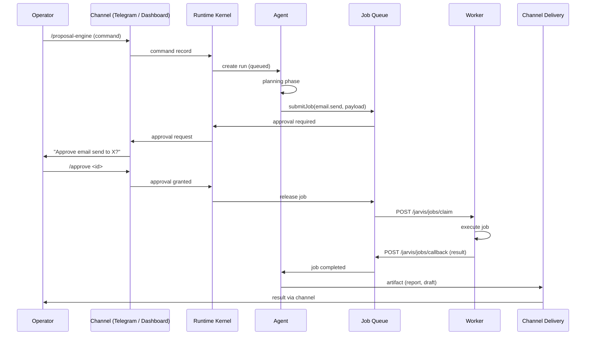
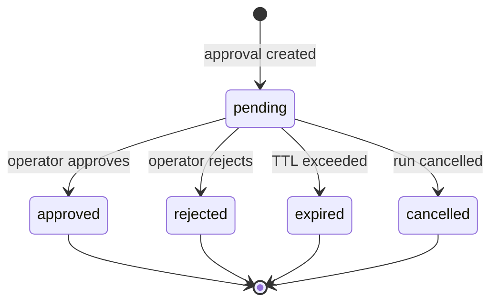
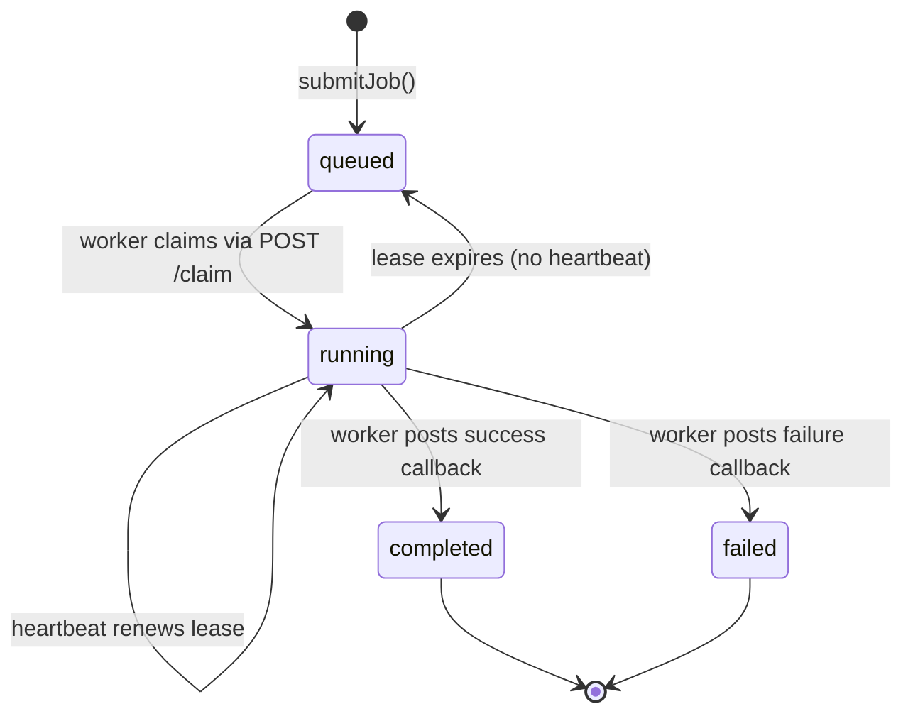

# Lifecycle Diagrams

Visual state machines for core Jarvis concepts. All diagrams use [Mermaid](https://mermaid.js.org/) syntax.

## Run State Machine

A run is a single execution of an agent, from creation to terminal state.

**Terminal states**: `completed`, `failed`, `cancelled`. All run state transitions are recorded in the `run_events` table for audit.

## High-Stakes Action Lifecycle

End-to-end flow from operator request through artifact delivery.

## Approval Flow

State machine for a single approval decision.

**Rules**:
- Approvals in `pending` state block the associated job from executing.
- Stale approvals do not auto-approve; they remain pending until explicitly resolved or expired.
- 17 job types always create approvals. 33 create approvals conditionally based on agent maturity and policy.
- Operators can resolve approvals via the dashboard API or Telegram bot (`/approve`, `/reject`).

## Job Lifecycle

State machine for a single job in the queue.

**Lease model**: Workers must send heartbeats to maintain their claim. If a worker crashes without sending a failure callback, the lease expires and the job returns to `queued` for another worker to claim.
